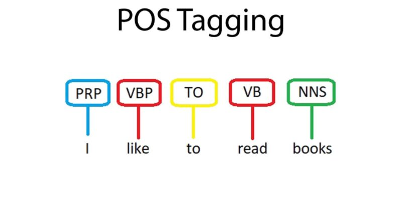

# POS-Tagging-BERT

Part of Speech Tagging for the Persian dataset using ParsBert and Multilingual BERT 

The repository contains Jupyter notebooks for testing different aspects of a POS-Tagging BERT model. The notebooks include:

* **Test 1 - ParsBert.ipynb:** This notebook tests the ParsBert model on the given dataset.

* **Test 2 - Increase Learning Rate - bad.ipynb:** This notebook tests the effect of increasing the learning rate on the performance of the model.

* **Test 3 - Decrease Weight decay.ipynb:** This notebook tests the effect of decreasing the weight decay on the performance of the model.

* **Test 4 - MultiLingual.ipynb:** This notebook tests the multilingual Bert model on the dataset instead of using ParsBert.

* **Test 5 - MultiLingual uncased.ipynb:** This notebook tests the uncased multilingual Bert model on the dataset.

* **Test 6 - ParsBert v2.ipynb:** This notebook tests the ParsBert v2 model on the given dataset.

In addition to the notebooks, the repository also contains a README.md file and a Report.pdf file. The README.md file provides information about the repository, including a brief overview of the model and instructions on how to run the notebooks. The Report.pdf file provides a more detailed analysis of the model's performance and the explanation of this exercise.

You can access the dataset in the Dataset folder.

Overall, the repository provides a good starting point for anyone interested in using a POS-Tagging BERT model. The notebooks are well-organized and easy to follow, and the report provides valuable insights into the model's performance.

------------------
Just so you know, you should adjust the used paths because the code has been written on Google Colab.
